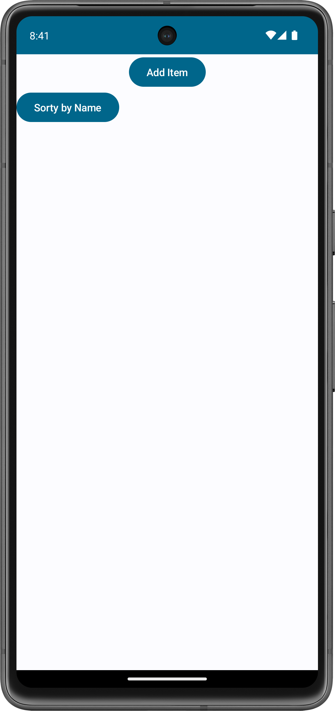

# Shopping List

This is a simple Shopping List application developed using Jetpack Compose for Android. The project was created following a [course](https://www.udemy.com/share/102Jgo3@XsZDs1CXVwhSrBZfwOx0m7Gls9TC3Vvyp-QUCKEr1uQ44IUJSVwaBeFLYe-0_Ywepw==/) on Udemy for Android development.

## Features

- Add new items to the shopping list with a name and quantity.
- Edit existing items directly within the list.
- Delete items from the shopping list.
- Sort items by name or quantity.

